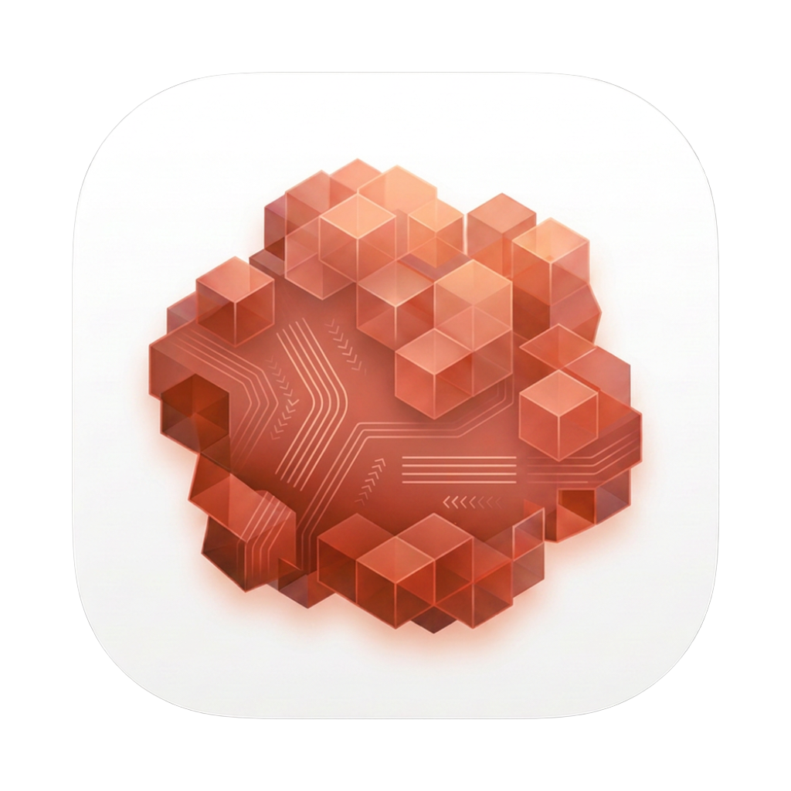
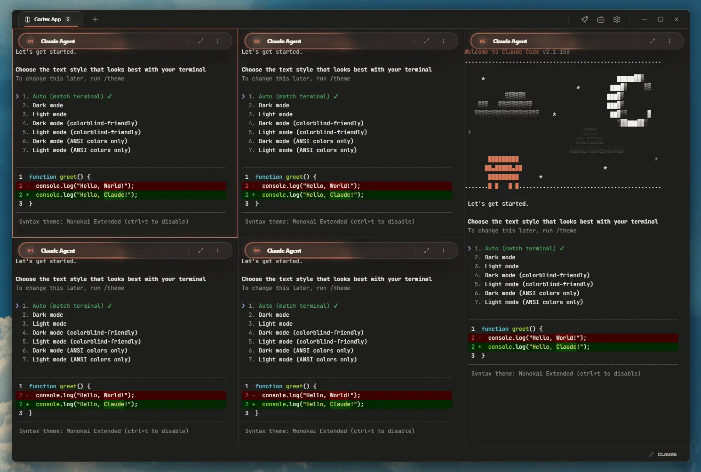
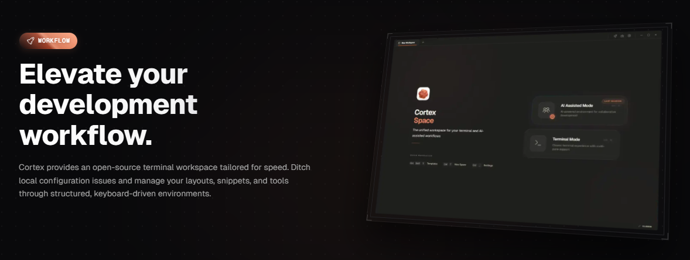

  

<h1 align="center">Cortex Space</h1>

<em>Local-First Multi-Pane Terminal Manager for Developers</em>

<strong>Native performance. Dynamic layouts. Keyboard-driven workflows.</strong>

---

<!-- Badges -->

  

    
    
    
    
    
  

  

    
    
    
    
  

---

  

  
  &nbsp;
  

---

## Project Status

  
  

**Under Development** -- Cortex Space is a native desktop terminal manager that replaces static terminal configurations with a dynamic, keyboard-driven multi-pane workspace. Built with Tauri and React, it provides a high-performance terminal experience with recursive split layouts, session persistence, and a plugin-free tool registry.

---

## Overview

Cortex Space unifies terminal instances, workspaces, and developer tooling into a single cohesive desktop application.

### Key Features
- **Multi-Pane Terminal Engine** -- Split, resize, and manage terminal panels powered by Xterm.js and Tauri-based PTY processes with full shell support (PowerShell, Bash, Zsh)
- **Dynamic Recursive Layouts** -- Horizontal and vertical splits with ratio-based resizing, drag-and-drop pane reordering, and quadrant-based repartitioning
- **Global Command Palette** -- Triggered via `Ctrl/Cmd + K` for switching workspaces, executing commands, and launching templates
- **Command Snippets** -- Save, organize, and execute reusable shell commands with dynamic `{{VAR}}` placeholder resolution
- **Workspace & Tab Management** -- Multiple isolated workspaces, each containing sub-tabs with independent terminal layouts
- **CLI Tool Registry** -- Discover and verify installation status of developer CLI tools (AI agents, language servers, build tools) with one-click install commands
- **Automatic Port Detection** -- Live parsing of terminal output for localhost URLs with TCP-liveness checking
- **Zen Mode** -- Full-screen focused terminal view, hiding all chrome
- **Theme System** -- 14 bundled themes (Catppuccin, Dracula, Nord, Tokyo Night, Gruvbox, and more) with dark/light/system scheme support and custom theme creation

---

## Tech Stack

 

| Layer | Technology | Purpose |
|:-----:|:----------:|:--------:|
| **Desktop Core** | Tauri v2, Rust | Native window management, PTY process isolation, OS integration |
| **Frontend** | React 19, TypeScript, Vite | Interactive GUI, layout rendering, component lifecycle |
| **Terminal Engine** | Xterm.js | Low-latency terminal rendering with fit and weblinks addons |
| **PTY Backend** | portable-pty (Rust) | Shell process spawning and I/O management |
| **Styling & UI** | Tailwind CSS, Radix UI, Base UI | Unified design system with accessible controls |
| **Animation** | Framer Motion | Spring-physics transitions, Z-axis scaling, drag gestures |
| **Drag & Drop** | dnd-kit | Pane header drag reordering with live quadrant previews |
| **Persistence** | Tauri Store Plugin | Local JSON-based storage for settings, workspaces, snippets |

---

## Features

### Completed
- Multi-pane terminal with real PTY shell sessions
- Dynamic recursive split layouts (horizontal/vertical) with resize handles
- Pane drag-and-drop repartitioning with animated ghost overlays
- Global command palette for workspace switching and template launching
- Command snippet repository with `{{VAR}}` placeholder resolution
- Multiple workspace support with sidebar, pinning, and renaming
- Sub-tab system for multiple layouts per workspace
- CLI tool agent registry with install-status detection
- Automatic localhost port detection and TCP-liveness checking
- 14 bundled themes with dark/light/system scheme support
- Custom theme creation and management
- Zen Mode for distraction-free terminal work
- Settings persistence for terminal font, size, shortcuts, and appearance
- Onboarding flow with profile selection and tool scanning
- Pane keyboard navigation (`Alt+Arrows`, `Ctrl+1-9`)
- State restoration across app launches
- Custom titlebar with minimize/maximize/close controls
- Self-updater via GitHub Releases

### In Progress
- Sidebar style tabbing
- Project-based workspaces
- Drag and drop skills to AI agents
- Auto-PR (automated pull request workflows)
- Session management
- Enhanced command snippets with advanced variable resolution

---

## Star History

<a href="https://www.star-history.com/?repos=icodecedd%2Fcortex-space&type=date&legend=top-left">
 <picture>
   <source media="(prefers-color-scheme: dark)" srcset="https://api.star-history.com/chart?repos=icodecedd/cortex-space&type=date&theme=dark&legend=top-left" />
   <source media="(prefers-color-scheme: light)" srcset="https://api.star-history.com/chart?repos=icodecedd/cortex-space&type=date&legend=top-left" />
   
 </picture>
</a>

---

## Contributing

We welcome contributions. See [CONTRIBUTING.md](CONTRIBUTING.md) for setup instructions, development workflow, and pull request guidelines.

---

  

