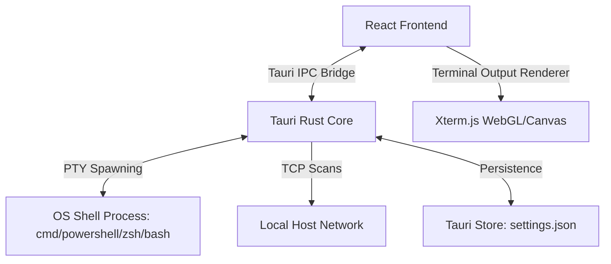

# Application Architecture: Cortex Space

Cortex Space utilizes a hybrid desktop application architecture built on **Tauri v2**. The application separates native OS operations (PTY execution, shell detection, file-system operations, TCP port scanning) from the presentation and user interface (React, Xterm.js).

---

## 1. High-Level System Architecture



### A. The Presentation Layer (Frontend)
- **Engine:** React 19 + Vite + TypeScript.
- **Responsibility:** Manages layout configurations, renders terminal windows, handles command snippets input, runs onboarding wizards, displays settings tabs, and processes user events.
- **Terminal Rendering:** Rather than displaying terminal output in standard divs, the app integrates `xterm` with GPU-accelerated renderers, resizing events automatically to match pane grid coordinates.

### B. The Native Core (Tauri Rust Backend)
- **Engine:** Rust v1.75+.
- **Responsibility:** Spawns system PTY (Pseudo-Terminal) processes, routes keyboard/character inputs to standard shell sessions, performs TCP handshakes for server checks, and exposes system commands (`install_agent_cli`, `check_command`) to detect global tools.
- **Tauri Commands:** The frontend communicates with Rust using Tauri's asynchronous IPC bridge (`invoke(...)` API).

---

## 2. Frontend Project Structure & Modules

The frontend is organized around a feature-driven design pattern to keep the workspace clean and maintainable:

```
src/
├── App.tsx                        # Main application entry and mode dispatcher
├── index.css                      # Global design system variables and Tailwind imports
├── components/                    # Global components and UI widgets
│   ├── dialogs/                   # Confirmation modals (e.g., Mode Change, Switcher)
│   ├── layout/                    # Layout shells (AppHeader, AppFooter)
│   ├── screens/                   # Top-level screen states (Onboarding, Mode Selector)
│   └── ui/                        # Reusable atomic UI (icons.tsx, select.tsx, empty-state)
├── features/                      # Domain-specific functional features
│   ├── cortex-library/            # Workspace templates, snippets, and assets library
│   ├── settings/                  # Settings panels, tab navigation, and settings UI
│   ├── setup/                     # 3-step directory setup wizard
│   ├── space/                     # Multi-pane grid manager and floating action bar
│   └── terminal/                  # Xterm.js terminal wrappers and PTY bindings
├── hooks/                         # Global React hooks (useTheme, useAgents, useSetupPanes)
├── lib/                           # Utility modules and client-side helpers
│   ├── store.ts                   # Settings persistence client bridge
│   └── setup-constants.ts         # Preset templates and default values
└── types.ts                       # Shared TypeScript definitions
```

---

## 3. State Management & Persistence Flow

State in Cortex Space is split between active runtime state (React hook trees) and persistent user configurations:

### A. Persistent State
- All configurations (typography, colors, zen mode states, shortcuts, enabled features) are persisted inside `settings.json` in the user's local App Data directory.
- This is managed via `@tauri-apps/plugin-store` in [store.ts](file:///c:/Users/Chaoscedd/Programming/web-development/cortex-space/src/lib/store.ts).
- To prevent slow disk read blocks on every render, `store.ts` loads configurations lazily on launch, maintaining a fast in-memory object cache (`cachedStore`) that is read synchronously.

### B. Runtime Pane Grid State
- Layout panes are represented as a binary tree of pane nodes. A node is either a terminal leaf containing a shell instance, or a parent node splitting its area horizontally or vertically at a given ratio.
- Layouts are managed inside `src/features/space/components/PaneElevator.tsx` using responsive split engines, updating parent coordinates during drags.

---

## 4. Rust Core & PTY Communication Bridge

Terminal sessions require native operating system resources. The bridge operates as follows:

1. **Instantiation:** When a terminal pane is created, the frontend triggers a Rust command to spawn a PTY thread tied to the user's default shell (e.g. `cmd.exe` on Windows).
2. **Channel Bridging:** Tauri establishes a write channel (to push keystrokes from Xterm.js down to the PTY stdin) and a read channel (to capture stdout/stderr from the shell).
3. **Data Routing:** Captured terminal output is pushed asynchronously from Rust as structured event messages directly into the React terminal component.
4. **Lifecycle Control:** When a pane is closed, the Rust core tears down the OS process tree to prevent zombie shell processes and resource leaks.
